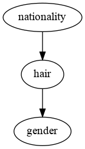
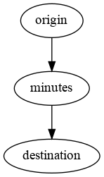
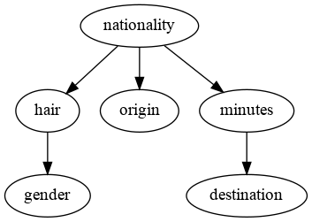

# An Approach Based on Bayesian Networks for Query Selectivity Estimation

This contains the code used for the TLDKS 2020 paper entitled "Selectivity Estimation with Attribute ValueDependencies using Linked Bayesian Networks".

## 10 minutes explanation

Imagine you have an airline database. In it you might have a `passengers` relation.

```python
>>> import phd

>>> passengers = phd.Relation(
...     name='passengers',
...     data={
...         'nationality': ('Swedish', 'Swedish', 'Swedish', 'Swedish', 'Swedish',
...                         'American', 'American', 'American', 'American', 'American'),
...         'gender': ('Male', 'Female', 'Male', 'Female', 'Female',
...                    'Male', 'Male', 'Female', 'Male', 'Female'),
...         'hair': ('Blond', 'Blond', 'Blond', 'Brown', 'Blond',
...                  'Brown', 'Dark', 'Brown', 'Brown', 'Blond')
...     }
... )

>>> passengers
  nationality  gender   hair
0     Swedish    Male  Blond
1     Swedish  Female  Blond
2     Swedish    Male  Blond
3     Swedish  Female  Brown
4     Swedish  Female  Blond
5    American    Male  Brown
6    American    Male   Dark
7    American  Female  Brown
8    American    Male  Brown
9    American  Female  Blond

```

If you were to run a query against the `passengers` relation, it would return a new relation with a particular number of rows. For example, if we were to run a query to retrieve the Swedish passengers, we would obtain 5 rows.

```python
>>> passengers.query('nationality == "Swedish"')
  nationality  gender   hair
0     Swedish    Male  Blond
1     Swedish  Female  Blond
2     Swedish    Male  Blond
3     Swedish  Female  Brown
4     Swedish  Female  Blond

```

Swell. The problem is that we could only know the number of rows in the result *after* running the query. What if we wanted to know the number of rows in the result *before* actually running the query? Doing so is called **cardinality estimation** and is the topic of this PhD. There are many ways to do cardinality estimation, each way necessarily having benefits and drawbacks.

As of 2018, the canonical approach is to maintain a histogram per attribute of each relation. Doing so means that we can accurately estimate the cardinality of queries involving a single attribute (such as the one above). But what happens if there are two attributes involved in a query? For example what happens if we want to retrieve the Swedish passengers who also happen to be blond.

```python
>>> passengers.query('nationality == "Swedish" and hair == "Blond"')
  nationality  gender   hair
0     Swedish    Male  Blond
1     Swedish  Female  Blond
2     Swedish    Male  Blond
4     Swedish  Female  Blond

```

If we had a histogram for each attribute then we would have known that `P(nationality='Swedish') = 0.5` and `P(hair='Blond') = 0.5`. In other words half of the passengers are Swedish and half are blond. But we couldn't possibly have known that `P(nationality='Swedish', hair='Blond') = 0.4` :person_with_blond_hair:. Indeed if we had assumed that `nationality` and `hair` were independent then we would have multiplied `P(nationality='Swedish')` by `P(hair='Blond')` and obtained `0.25`. The thing is that `nationality` and `hair` are dependent variables (knowing the nationality can help knowing the hair color, and vice-versa).

In this toy example we've only underestimated the number of rows by `10 * (0.4 - 0.25) = 1.5`. However assuming independence in practice can lead to large estimation errors that can have devastating effets [1] :boom:. Indeed cardinality estimation is the main component of the **cost model** that a **query optimisers** uses to find the best way to execute a database query. A accurate cardinality estimation method could potentially have dramatic effects on query processing in general (in a good way!).

Well what can we do? A lot of research has gone into building better histograms [2]. There are some very nice contributions in this area but they still don't take into account dependencies between attributes. A natural idea is to use multi-dimensional histograms [3] but this doesn't scale well once there are more than a dozen attributes (in practice we are dealing with hundreds of variables). Another smart approach is to run the query on a sample of the database and extrapolate the number of rows [4]. This works reasonably well and is actually used by the newer versions of Oracle Database. The downside is that sampling accross joins doesn't really work [5]. Some have proposed using supervised learning [6] and even deep learning [7] but to no great avail.

When I started my PhD the approach that appealed to me the most was the use of Bayesian networks [8].

Let's see what this looks like. We can start by fitting a Bayesian networks to the `passengers` relation.

```python
>>> passengers_bn = phd.BayesianNetwork()
>>> passengers_bn = passengers_bn.fit(passengers)
>>> passengers_bn.to_dot().write_png('figures/passengers_bn.png')

```

<div align="center">
  
</div>

We can now query the Bayesian network to know the percentage of people who are both Swedish and blond. In query optimisation this percentage is called the **selectivity** of a query, it is basically equivalent to the cardinality.

```python
>>> len(passengers) * passengers_bn.p(nationality='Swedish', hair='Blond')
4.0

```

In this case the estimate is spot on. Now what happens when we perform a query over multiple relations? For example say we have a `routes` relation.

```python
>>> routes = phd.Relation(
...     name='routes',
...     data={
...         'origin': ['Stockholm', 'Stockholm', 'Stockholm', 'Fresno', 'Fresno', 'Fresno'],
...         'destination': ['Boston', 'San Francisco', 'New-York', 'Seattle', 'San Francisco', 'Portland'],
...         'minutes': [515, 830, 515, 130, 60, 110],
...     }
... )

>>> routes
      origin    destination  minutes
0  Stockholm         Boston      515
1  Stockholm  San Francisco      830
2  Stockholm       New-York      515
3     Fresno        Seattle      130
4     Fresno  San Francisco       60
5     Fresno       Portland      110

```

We also have a `flights` relation that associates passengers with routes.

```python
>>> flights = phd.Relation(
...     name='flights',
...     data={
...         'passenger_id': [0, 0, 0, 1, 1, 1, 2, 3, 4, 5, 5, 6, 7, 7, 8, 9],
...         'route_id': [0, 1, 2, 0, 1, 2, 2, 0, 1, 3, 5, 3, 3, 5, 4, 4]
...     },
...     foreign_keys=[
...         ('passenger_id', 'passengers'),
...         ('route_id', 'routes')
...     ]
... )

>>> flights
    passenger_id  route_id
0              0         0
1              0         1
2              0         2
3              1         0
4              1         1
5              1         2
6              2         2
7              3         0
8              4         1
9              5         3
10             5         5
11             6         3
12             7         3
13             7         5
14             8         4
15             9         4

```

Now what if we want to query the Swedish passengers who took flights departing from Stockholm?

```python
>>> flights.join(passengers, on='passenger_id')\
...        .join(routes, on='route_id')\
...        .query('nationality == "Swedish" and origin == "Stockholm"')\
...        .drop(columns=['passenger_id', 'route_id'])
  nationality  gender   hair     origin    destination  minutes
0     Swedish    Male  Blond  Stockholm         Boston      515
1     Swedish    Male  Blond  Stockholm  San Francisco      830
2     Swedish    Male  Blond  Stockholm       New-York      515
3     Swedish  Female  Blond  Stockholm         Boston      515
4     Swedish  Female  Blond  Stockholm  San Francisco      830
5     Swedish  Female  Blond  Stockholm       New-York      515
6     Swedish    Male  Blond  Stockholm       New-York      515
7     Swedish  Female  Brown  Stockholm         Boston      515
8     Swedish  Female  Blond  Stockholm  San Francisco      830

```

There are 9 such cases. There could have been at most 15 because that's the total number of recorded flights. In our first paper we built one Bayesian network per relation and made the assumptions that attributes were independent between relations.

```python
>>> routes_bn = phd.BayesianNetwork().fit(routes)
>>> routes_bn.to_dot().write_png('figures/routes_bn.png')

```

<div align="center">
  
</div>

```python
>>> len(flights) * passengers_bn.p(nationality='Swedish') * routes_bn.p(origin='Stockholm')
4.0

```

The estimate is off by a factor of 2. This is because in our database Swedish people tend to take flights departing from Stockholm (duh!). It turns out that dependencies between attributes of different relations are a plague and there doesn't yet seem to be a canonical way of handling them (that is, as of 2018).

One might point out that we could build a Bayesian network on the joined relations. This is a totally valid approach.

```python
>>> big_rel = flights.join(passengers, on='passenger_id').join(routes, on='route_id')

>>> big_bn = phd.BayesianNetwork().fit(big_rel)
>>> big_bn.to_dot().write_png('figures/big_bn.png')

```

<div align="center">
  
</div>

```python
>>> len(flights) * big_bn.p(nationality='Swedish', origin='Stockholm')
9.0

```

This time the estimate is exact, but at what cost? The issue is that the relations have to be joined before building the Bayesian network, which in practice takes too much time and memory. What's more we've lost the ability to compute cardinalities over individual relations.

```python
>>> # Recall that the following query returned 4.0 earlier
>>> len(passengers) * big_bn.p(nationality='Swedish', hair='Blond')
5.0

```

We introduced a solution to this problem in our second paper. The idea is to leverage the topology of the relations.

```python
>>> relations = [passengers, routes, flights]
>>> rbn = phd.RecursiveBayesianNetwork().fit(relations)

```

```python
>>> tables = ['passengers', 'flights', 'routes']
>>> len(flights) * rbn.p(tables, passengers__nationality='Swedish', routes__origin='Stockholm')
9.0

>>> len(passengers) * rbn.p(['passengers'], nationality='Swedish', hair='Blond')
4.0

```

That's it! Of course there are certain details that I have omitted here for the sake of brevity. These include dealing with continuous variables, using comparison operators other than `=`, and handling memory constraints. You can find more information in the published papers.


## Benchmarks

You first need to build the [PostgreSQL](https://www.postgresql.org/) and [pgweb](https://sosedoff.github.io/pgweb/) services.

```sh
docker-compose build
```

You then have to start the services.

```sh
docker-compose up -d
```

Then you have to provision the database with the IMDB data. This takes a few hours but you only have to do it once.

```sh
docker-compose run --rm job bash setup.sh
```

You can now access the [pgweb](https://github.com/sosedoff/pgweb) interface by navigating to [localhost:8081](localhost:8081). You can stop the services once you are done.

```sh
docker-compose down
```
